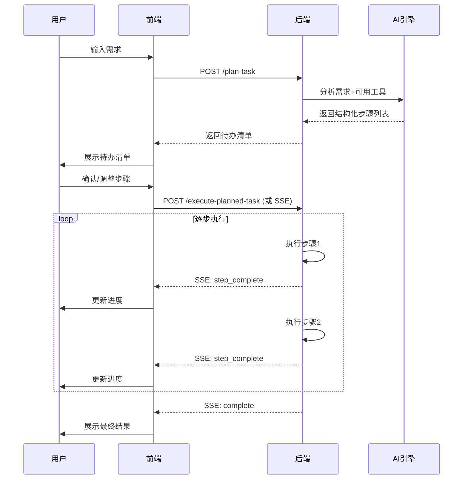

# 动态任务规划与逐步执行使用指南

## 📋 功能概述

实现了真正的**AI驱动动态任务规划**和**逐步实时执行**：

1. ✅ **智能生成待办清单**：基于用户输入、智能体工具，AI自动生成详细步骤
2. ✅ **细粒度步骤**：不只是"意图识别"和"生成回答"，而是具体的工具调用、数据处理等
3. ✅ **逐步执行**：每步独立执行，结果可追溯
4. ✅ **SSE实时同步**：每完成一步就向前端推送进度和结果

---

## 🎯 核心流程



---

## 🔌 API接口

### 1. 规划任务（生成待办清单）

```http
POST /api/unified-agent/plan-task?agentId=1&query=帮我查询订单ORDER123的状态并分析退款可能性
```

**响应示例：**
```json
{
  "code": 0,
  "data": {
    "taskId": "task_1_1713500000000",
    "taskDescription": "帮我查询订单ORDER123的状态并分析退款可能性",
    "steps": [
      {
        "stepId": "step_1",
        "stepNumber": 1,
        "description": "调用 订单查询工具 获取数据",
        "stepType": "TOOL_CALL",
        "resourceId": 10,
        "resourceName": "订单查询工具",
        "estimatedDurationMs": 1500,
        "isRequired": true,
        "dependencies": []
      },
      {
        "stepId": "step_2",
        "stepNumber": 2,
        "description": "处理和分析数据",
        "stepType": "DATA_PROCESSING",
        "estimatedDurationMs": 3000,
        "isRequired": true,
        "dependencies": ["step_1"]
      },
      {
        "stepId": "step_3",
        "stepNumber": 3,
        "description": "检查条件是否满足",
        "stepType": "CONDITION_CHECK",
        "estimatedDurationMs": 500,
        "isRequired": true,
        "dependencies": ["step_1", "step_2"]
      },
      {
        "stepId": "step_4",
        "stepNumber": 4,
        "description": "汇总所有结果并生成最终回答",
        "stepType": "RESULT_SUMMARY",
        "estimatedDurationMs": 2000,
        "isRequired": true,
        "dependencies": ["step_1", "step_2", "step_3"]
      }
    ],
    "estimatedDurationMs": 7000,
    "requiresConfirmation": true
  }
}
```

---

### 2. 同步执行（简单场景）

```http
POST /api/unified-agent/execute-planned-task?taskId=task_1_1713500000000
Content-Type: application/json

["step_1", "step_2", "step_3", "step_4"]
```

**响应：**
```json
{
  "code": 0,
  "data": {
    "success": true,
    "finalResponse": "任务已完成！\n\n执行摘要：\n[步骤 1] 调用 订单查询工具 获取数据: {...}\n[步骤 2] 处理和分析数据: {...}\n...\n\n所有步骤已成功执行。",
    "executionTimeMs": 6500,
    "decisionPath": [...]
  }
}
```

---

### 3. 流式执行（⭐推荐，实时反馈）

```http
GET /api/unified-agent/execute-stream?agentId=1&query=帮我查询订单ORDER123的状态
Accept: text/event-stream
```

**SSE事件流：**

```javascript
// 事件1: 开始规划
event: planning
data: {"message":"正在分析任务...","progress":10}

// 事件2: 规划完成
event: plan_ready
data: {
  "message":"任务规划完成",
  "taskId":"task_1_1713500000000",
  "totalSteps":4,
  "steps":[...],
  "progress":20
}

// 事件3: 步骤1开始
event: step_start
data: {
  "stepNumber":1,
  "totalSteps":4,
  "stepId":"step_1",
  "description":"调用 订单查询工具 获取数据",
  "stepType":"TOOL_CALL",
  "progress":37
}

// 事件4: 步骤1完成
event: step_complete
data: {
  "stepNumber":1,
  "stepId":"step_1",
  "result":{"success":true,"toolId":10,"result":"订单查询成功"},
  "progress":37
}

// 事件5: 步骤2开始
event: step_start
data: {"stepNumber":2,"description":"处理和分析数据","progress":55}

// 事件6: 步骤2完成
event: step_complete
data: {"stepNumber":2,"result":{...},"progress":55}

// ... 继续执行后续步骤 ...

// 事件N: 生成最终回答
event: generating_response
data: {"message":"正在生成最终回答...","progress":95}

// 事件N+1: 完成
event: complete
data: {
  "success":true,
  "finalResponse":"订单ORDER123状态为已发货，符合退款条件...",
  "executionTimeMs":6500,
  "totalSteps":4,
  "progress":100
}
```

---

## 💻 前端集成示例

### Vue3 + TypeScript + EventSource

```vue
<template>
  <div class="smart-agent">
    <h2>🤖 智能体助手</h2>
    
    <!-- 输入框 -->
    <div class="input-section">
      <textarea 
        v-model="userQuery" 
        placeholder="请输入您的需求..."
        rows="3"
      />
      <div class="actions">
        <button @click="handlePlanTask" :disabled="isProcessing">
          📋 生成待办清单
        </button>
        <button @click="handleStreamExecute" :disabled="isProcessing || !taskPlan">
          ▶️ 流式执行
        </button>
      </div>
    </div>

    <!-- 待办清单展示 -->
    <div v-if="taskPlan" class="todo-list">
      <h3>📝 待办清单（共 {{ taskPlan.steps.length }} 步）</h3>
      
      <div 
        v-for="(step, index) in taskPlan.steps" 
        :key="step.stepId"
        class="step-card"
        :class="{
          'step-pending': !executedSteps.has(step.stepId),
          'step-running': currentStep === step.stepId,
          'step-completed': executedSteps.has(step.stepId)
        }"
      >
        <div class="step-header">
          <span class="step-number">{{ step.stepNumber }}</span>
          <span class="step-desc">{{ step.description }}</span>
          <span class="step-type">{{ getStepTypeIcon(step.stepType) }}</span>
        </div>
        
        <div v-if="stepResults[step.stepId]" class="step-result">
          <pre>{{ JSON.stringify(stepResults[step.stepId], null, 2) }}</pre>
        </div>
        
        <div v-if="currentStep === step.stepId" class="step-progress">
          <div class="spinner"></div>
          <span>执行中...</span>
        </div>
      </div>
    </div>

    <!-- 实时进度条 -->
    <div v-if="isStreaming" class="progress-bar">
      <div class="progress-fill" :style="{ width: progress + '%' }"></div>
      <span class="progress-text">{{ progress }}%</span>
    </div>

    <!-- 最终结果 -->
    <div v-if="finalResult" class="final-result">
      <h3>✅ 执行完成</h3>
      <div class="response">{{ finalResult.finalResponse }}</div>
      <div class="meta">
        耗时: {{ finalResult.executionTimeMs }}ms | 
        步骤数: {{ finalResult.totalSteps }}
      </div>
    </div>
  </div>
</template>

<script setup lang="ts">
import { ref, reactive } from 'vue';

interface TaskStep {
  stepId: string;
  stepNumber: number;
  description: string;
  stepType: string;
  resourceId?: number;
  resourceName?: string;
  estimatedDurationMs?: number;
  isRequired: boolean;
  dependencies: string[];
}

interface TaskExecutionPlan {
  taskId: string;
  taskDescription: string;
  steps: TaskStep[];
  estimatedDurationMs: number;
  requiresConfirmation: boolean;
}

const userQuery = ref('');
const taskPlan = ref<TaskExecutionPlan | null>(null);
const isProcessing = ref(false);
const isStreaming = ref(false);
const progress = ref(0);
const currentStep = ref<string | null>(null);
const executedSteps = ref<Set<string>>(new Set());
const stepResults = ref<Record<string, any>>({});
const finalResult = ref<any>(null);

/**
 * 规划任务（生成待办清单）
 */
const handlePlanTask = async () => {
  if (!userQuery.value.trim()) return;
  
  isProcessing.value = true;
  try {
    const response = await fetch(
      `/api/unified-agent/plan-task?agentId=1&query=${encodeURIComponent(userQuery.value)}`,
      { method: 'POST' }
    );
    
    const result = await response.json();
    if (result.code === 0) {
      taskPlan.value = result.data;
      // 重置状态
      executedSteps.value.clear();
      stepResults.value = {};
      finalResult.value = null;
    } else {
      alert('规划失败: ' + result.message);
    }
  } catch (error) {
    console.error('规划任务失败', error);
    alert('网络错误，请重试');
  } finally {
    isProcessing.value = false;
  }
};

/**
 * 流式执行任务
 */
const handleStreamExecute = () => {
  if (!taskPlan.value) return;
  
  isStreaming.value = true;
  isProcessing.value = true;
  progress.value = 0;
  currentStep.value = null;
  executedSteps.value.clear();
  stepResults.value = {};
  finalResult.value = null;
  
  // 创建EventSource连接
  const eventSource = new EventSource(
    `/api/unified-agent/execute-stream?agentId=1&query=${encodeURIComponent(userQuery.value)}`
  );
  
  // 监听规划阶段
  eventSource.addEventListener('planning', (event) => {
    const data = JSON.parse(event.data);
    console.log('规划中:', data.message);
    progress.value = data.progress;
  });
  
  // 监听规划完成
  eventSource.addEventListener('plan_ready', (event) => {
    const data = JSON.parse(event.data);
    console.log('规划完成，共', data.totalSteps, '步');
    progress.value = data.progress;
  });
  
  // 监听步骤开始
  eventSource.addEventListener('step_start', (event) => {
    const data = JSON.parse(event.data);
    console.log(`步骤 ${data.stepNumber}/${data.totalSteps} 开始:`, data.description);
    currentStep.value = data.stepId;
    progress.value = data.progress;
  });
  
  // 监听步骤完成
  eventSource.addEventListener('step_complete', (event) => {
    const data = JSON.parse(event.data);
    console.log(`步骤 ${data.stepNumber} 完成`);
    
    // 标记步骤完成
    executedSteps.value.add(data.stepId);
    stepResults.value[data.stepId] = data.result;
    currentStep.value = null;
    progress.value = data.progress;
  });
  
  // 监听生成回答
  eventSource.addEventListener('generating_response', (event) => {
    const data = JSON.parse(event.data);
    console.log('生成最终回答...');
    progress.value = data.progress;
  });
  
  // 监听完成
  eventSource.addEventListener('complete', (event) => {
    const data = JSON.parse(event.data);
    console.log('执行完成！');
    
    finalResult.value = data;
    progress.value = 100;
    isStreaming.value = false;
    isProcessing.value = false;
    
    // 关闭连接
    eventSource.close();
  });
  
  // 监听错误
  eventSource.addEventListener('error', (event) => {
    const data = JSON.parse(event.data);
    console.error('执行错误:', data.error);
    
    alert('执行失败: ' + data.error);
    isStreaming.value = false;
    isProcessing.value = false;
    
    eventSource.close();
  });
  
  // 连接错误
  eventSource.onerror = (error) => {
    console.error('SSE连接错误', error);
    alert('连接中断，请重试');
    isStreaming.value = false;
    isProcessing.value = false;
    eventSource.close();
  };
};

/**
 * 获取步骤类型图标
 */
const getStepTypeIcon = (stepType: string): string => {
  const icons: Record<string, string> = {
    TOOL_CALL: '🔧',
    DATA_PROCESSING: '📊',
    CONDITION_CHECK: '⚖️',
    KNOWLEDGE_RETRIEVAL: '📚',
    API_CALL: '🌐',
    RESULT_SUMMARY: '📝'
  };
  return icons[stepType] || '⚙️';
};
</script>

<style scoped>
.smart-agent {
  max-width: 800px;
  margin: 0 auto;
  padding: 20px;
}

.input-section textarea {
  width: 100%;
  padding: 10px;
  border: 1px solid #ddd;
  border-radius: 4px;
  font-size: 14px;
}

.actions {
  margin-top: 10px;
  display: flex;
  gap: 10px;
}

.todo-list {
  margin-top: 20px;
}

.step-card {
  padding: 15px;
  margin: 10px 0;
  background: #f9f9f9;
  border-radius: 8px;
  border-left: 4px solid #ddd;
  transition: all 0.3s;
}

.step-card.step-running {
  border-left-color: #2196F3;
  background: #e3f2fd;
}

.step-card.step-completed {
  border-left-color: #4CAF50;
  background: #e8f5e9;
}

.step-header {
  display: flex;
  align-items: center;
  gap: 10px;
}

.step-number {
  display: inline-block;
  width: 28px;
  height: 28px;
  line-height: 28px;
  text-align: center;
  background: #2196F3;
  color: white;
  border-radius: 50%;
  font-weight: bold;
}

.step-desc {
  flex: 1;
  font-weight: 500;
}

.step-type {
  font-size: 1.2em;
}

.step-result {
  margin-top: 10px;
  padding: 10px;
  background: white;
  border-radius: 4px;
  font-size: 0.9em;
}

.step-result pre {
  margin: 0;
  white-space: pre-wrap;
  word-wrap: break-word;
}

.step-progress {
  margin-top: 10px;
  display: flex;
  align-items: center;
  gap: 10px;
  color: #2196F3;
}

.spinner {
  width: 16px;
  height: 16px;
  border: 2px solid #2196F3;
  border-top-color: transparent;
  border-radius: 50%;
  animation: spin 0.8s linear infinite;
}

@keyframes spin {
  to { transform: rotate(360deg); }
}

.progress-bar {
  margin: 20px 0;
  height: 8px;
  background: #e0e0e0;
  border-radius: 4px;
  position: relative;
  overflow: hidden;
}

.progress-fill {
  height: 100%;
  background: linear-gradient(90deg, #4CAF50, #2196F3);
  transition: width 0.3s;
}

.progress-text {
  position: absolute;
  right: 10px;
  top: -20px;
  font-size: 0.9em;
  color: #666;
}

.final-result {
  margin-top: 20px;
  padding: 20px;
  background: #e8f5e9;
  border-radius: 8px;
  border-left: 4px solid #4CAF50;
}

.response {
  margin: 10px 0;
  line-height: 1.6;
  white-space: pre-wrap;
}

.meta {
  margin-top: 10px;
  font-size: 0.9em;
  color: #666;
}
</style>
```

---

## 🎨 步骤类型说明

| 步骤类型 | 说明 | 图标 | 示例 |
|---------|------|------|------|
| `TOOL_CALL` | 调用工具 | 🔧 | 查询订单、发送邮件 |
| `DATA_PROCESSING` | 数据处理 | 📊 | 数据分析、格式转换 |
| `CONDITION_CHECK` | 条件检查 | ⚖️ | 判断是否满足退款条件 |
| `KNOWLEDGE_RETRIEVAL` | 知识库检索 | 📚 | 检索相关文档 |
| `API_CALL` | API调用 | 🌐 | 调用外部接口 |
| `RESULT_SUMMARY` | 结果汇总 | 📝 | 生成最终回答 |

---

## 🔧 后端实现要点

### 1. AI驱动的任务规划

```java
// TODO: 生产环境应使用LLM的结构化输出
private List<TaskExecutionPlan.TaskStep> generateAiDrivenTaskPlan(
        String query, Agent agent, List<Tools> availableTools) {
    
    // 构建Prompt
    String prompt = buildPlanningPrompt(query, agent, availableTools);
    
    // 调用大模型（使用结构化输出）
    String jsonResult = callLLMWithStructuredOutput(prompt);
    
    // 解析JSON为步骤列表
    return parseStepsFromJson(jsonResult);
}
```

**Prompt示例：**
```
你是一个任务规划专家。根据用户的需求和可用的工具，生成详细的执行步骤。

用户需求：{{query}}

可用工具：
{{tools}}

请生成JSON格式的执行计划，包含以下步骤信息：
- stepId: 步骤ID
- description: 步骤描述
- stepType: 步骤类型（TOOL_CALL/DATA_PROCESSING/CONDITION_CHECK等）
- resourceId: 资源ID（如果是工具调用）
- estimatedDurationMs: 预估耗时
- isRequired: 是否必须
- dependencies: 依赖的步骤ID列表

要求：
1. 步骤要具体，不要笼统
2. 考虑步骤之间的依赖关系
3. 预估合理的执行时间
```

### 2. 逐步执行逻辑

```java
private DecisionExecutionResult executeStepsSequentially(...) {
    for (TaskStep step : steps) {
        // 执行当前步骤
        Object result = executeSingleStep(step, context, userId);
        
        // 保存结果到上下文
        context.put(step.getStepId(), result);
        
        // TODO: 如果是SSE模式，推送进度
    }
    
    // 基于所有步骤结果生成最终回答
    return generateFinalResponse(steps, context);
}
```

### 3. SSE实时推送

```java
// 每完成一步就推送
sendSseEvent(emitter, "step_complete", Map.of(
    "stepNumber", i + 1,
    "stepId", step.getStepId(),
    "result", stepResult,
    "progress", calculateProgress(i, totalSteps)
));
```

---

## 🚀 优化建议

### 短期优化
1. ✅ 实现基于规则的任务规划（已完成）
2. ⏳ 接入LLM实现真正的AI规划
3. ⏳ 完善工具调用逻辑
4. ⏳ 添加步骤重试机制

### 长期优化
1. 📈 支持并行执行无依赖的步骤
2. 📈 实现步骤级别的错误恢复
3. 📈 添加执行历史回放功能
4. 📈 支持用户中断和修改执行计划

---

## 📝 注意事项

1. **超时处理**：SSE连接有超时限制（默认5分钟），长时间任务需要心跳
2. **错误处理**：某步失败时，可以选择跳过、重试或终止
3. **权限控制**：确保用户只能访问自己有权限的工具
4. **性能优化**：大量步骤时，考虑分页加载待办清单

---

**最后更新**: 2026-04-19  
**版本**: v3.0
