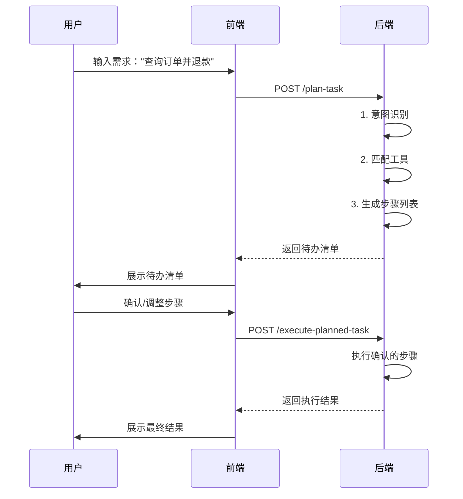

# 任务规划与待办清单功能使用指南

## 📋 功能概述

本功能实现了"龙虾"架构中的**感知-决策-执行**分离模式：

1. **规划阶段**：分析用户意图，生成待办清单（不执行）
2. **确认阶段**：前端展示待办清单，用户可确认/调整
3. **执行阶段**：根据用户确认的步骤逐步执行

## 🎯 典型应用场景

### 场景1：复杂订单处理

**用户请求：**
```
"帮我查询订单ORDER123，如果符合条件就申请退款"
```

**系统返回待办清单：**
```json
{
  "taskId": "task_1_1714000000000",
  "taskDescription": "帮我查询订单ORDER123，如果符合条件就申请退款",
  "steps": [
    {
      "stepId": "step_1",
      "stepNumber": 1,
      "description": "识别用户意图",
      "stepType": "INTENT_RECOGNITION",
      "estimatedDurationMs": 200,
      "isRequired": true
    },
    {
      "stepId": "step_2",
      "stepNumber": 2,
      "description": "调用工具: 订单查询工具",
      "stepType": "TOOL_CALL",
      "resourceName": "订单查询工具",
      "estimatedDurationMs": 1000,
      "isRequired": true,
      "dependencies": ["step_1"]
    },
    {
      "stepId": "step_3",
      "stepNumber": 3,
      "description": "调用工具: 退款处理工具",
      "stepType": "TOOL_CALL",
      "resourceName": "退款处理工具",
      "estimatedDurationMs": 1000,
      "isRequired": false,
      "dependencies": ["step_1"]
    },
    {
      "stepId": "step_4",
      "stepNumber": 4,
      "description": "生成最终回答",
      "stepType": "RESPONSE_GENERATION",
      "estimatedDurationMs": 2000,
      "isRequired": true,
      "dependencies": ["step_1", "step_2", "step_3"]
    }
  ],
  "estimatedDurationMs": 4200,
  "requiresConfirmation": true
}
```

**前端展示：**
```
📋 任务执行计划

我将为您执行以下步骤：

✅ 1. 识别用户意图 (预计 0.2秒)
✅ 2. 调用工具: 订单查询工具 (预计 1秒)
☑️ 3. 调用工具: 退款处理工具 (预计 1秒) [可选]
✅ 4. 生成最终回答 (预计 2秒)

总预估耗时: 4.2秒

[确认执行] [调整步骤] [取消]
```

## 🔌 API接口说明

### 1. 规划任务（返回待办清单）

**接口：** `POST /api/unified-agent/plan-task`

**请求参数：**
```json
{
  "agentId": 1,
  "query": "帮我查询订单ORDER123并申请退款",
  "context": {
    "sessionId": "session_001"
  }
}
```

**响应示例：**
```json
{
  "code": 200,
  "data": {
    "taskId": "task_1_1714000000000",
    "taskDescription": "帮我查询订单ORDER123并申请退款",
    "steps": [
      {
        "stepId": "step_1",
        "stepNumber": 1,
        "description": "识别用户意图",
        "stepType": "INTENT_RECOGNITION",
        "estimatedDurationMs": 200,
        "isRequired": true,
        "dependencies": []
      },
      {
        "stepId": "step_2",
        "stepNumber": 2,
        "description": "调用工具: 订单查询",
        "stepType": "TOOL_CALL",
        "resourceId": 10,
        "resourceName": "订单查询工具",
        "estimatedDurationMs": 1000,
        "isRequired": true,
        "dependencies": ["step_1"]
      }
    ],
    "estimatedDurationMs": 3200,
    "requiresConfirmation": true,
    "agentId": 1,
    "userId": 1,
    "createdAt": 1714000000000
  }
}
```

### 2. 执行已确认的任务

**接口：** `POST /api/unified-agent/execute-planned-task`

**请求参数：**
```json
{
  "taskId": "task_1_1714000000000",
  "confirmedSteps": ["step_1", "step_2", "step_4"]  // 用户选择执行的步骤
}
```

**响应示例：**
```json
{
  "code": 200,
  "data": {
    "finalResponse": "订单ORDER123查询成功，状态为已发货。由于订单已发货，无法直接退款，需要您先申请退货...",
    "decisionPath": [...],
    "success": true,
    "executionTimeMs": 3500
  }
}
```

## 💻 前端集成示例

### Vue3 + TypeScript 示例

```typescript
// types/task.ts
export interface TaskStep {
  stepId: string;
  stepNumber: number;
  description: string;
  stepType: string;
  resourceName?: string;
  estimatedDurationMs: number;
  isRequired: boolean;
  dependencies: string[];
}

export interface TaskExecutionPlan {
  taskId: string;
  taskDescription: string;
  steps: TaskStep[];
  estimatedDurationMs: number;
  requiresConfirmation: boolean;
}

// composables/useTaskPlanner.ts
import { ref } from 'vue';
import axios from 'axios';

export function useTaskPlanner() {
  const currentPlan = ref<TaskExecutionPlan | null>(null);
  const isPlanning = ref(false);
  const isExecuting = ref(false);

  // 规划任务
  const planTask = async (agentId: number, query: string) => {
    isPlanning.value = true;
    try {
      const response = await axios.post('/api/unified-agent/plan-task', null, {
        params: { agentId, query }
      });
      currentPlan.value = response.data.data;
      return currentPlan.value;
    } finally {
      isPlanning.value = false;
    }
  };

  // 执行任务
  const executeTask = async (confirmedSteps?: string[]) => {
    if (!currentPlan.value) {
      throw new Error('没有待执行的任务计划');
    }

    isExecuting.value = true;
    try {
      const response = await axios.post(
        '/api/unified-agent/execute-planned-task',
        confirmedSteps,
        {
          params: { taskId: currentPlan.value.taskId }
        }
      );
      return response.data.data;
    } finally {
      isExecuting.value = false;
      currentPlan.value = null; // 执行完成后清空
    }
  };

  return {
    currentPlan,
    isPlanning,
    isExecuting,
    planTask,
    executeTask
  };
}
```

### 组件示例

```vue
<template>
  <div class="task-planner">
    <!-- 输入框 -->
    <div class="input-section">
      <input 
        v-model="userQuery" 
        placeholder="请输入您的需求..."
        @keyup.enter="handlePlan"
      />
      <button @click="handlePlan" :disabled="isPlanning">
        {{ isPlanning ? '规划中...' : '分析任务' }}
      </button>
    </div>

    <!-- 待办清单展示 -->
    <div v-if="currentPlan" class="todo-list">
      <h3>📋 任务执行计划</h3>
      <p class="description">{{ currentPlan.taskDescription }}</p>
      
      <div class="steps">
        <div 
          v-for="step in currentPlan.steps" 
          :key="step.stepId"
          class="step-item"
          :class="{ selected: selectedSteps.includes(step.stepId) }"
        >
          <input 
            type="checkbox"
            :checked="selectedSteps.includes(step.stepId)"
            :disabled="step.isRequired"
            @change="toggleStep(step.stepId)"
          />
          <span class="step-desc">{{ step.description }}</span>
          <span class="step-time">({{ formatDuration(step.estimatedDurationMs) }})</span>
          <span v-if="!step.isRequired" class="optional-tag">可选</span>
        </div>
      </div>

      <div class="summary">
        <p>总预估耗时: {{ formatDuration(currentPlan.estimatedDurationMs) }}</p>
        <p>将执行 {{ selectedSteps.length }}/{{ currentPlan.steps.length }} 个步骤</p>
      </div>

      <div class="actions">
        <button @click="handleExecute" :disabled="isExecuting">
          {{ isExecuting ? '执行中...' : '确认执行' }}
        </button>
        <button @click="handleCancel">取消</button>
      </div>
    </div>

    <!-- 执行结果 -->
    <div v-if="executionResult" class="result">
      <h3>✅ 执行结果</h3>
      <p>{{ executionResult.finalResponse }}</p>
      <p class="time-info">耗时: {{ executionResult.executionTimeMs }}ms</p>
    </div>
  </div>
</template>

<script setup lang="ts">
import { ref, computed } from 'vue';
import { useTaskPlanner } from '@/composables/useTaskPlanner';

const { currentPlan, isPlanning, isExecuting, planTask, executeTask } = useTaskPlanner();

const userQuery = ref('');
const selectedSteps = ref<string[]>([]);
const executionResult = ref<any>(null);

// 监听计划变化，自动选中所有步骤
watch(currentPlan, (plan) => {
  if (plan) {
    selectedSteps.value = plan.steps.map(s => s.stepId);
  }
});

const handlePlan = async () => {
  if (!userQuery.value.trim()) return;
  executionResult.value = null;
  await planTask(1, userQuery.value);
};

const toggleStep = (stepId: string) => {
  const index = selectedSteps.value.indexOf(stepId);
  if (index > -1) {
    selectedSteps.value.splice(index, 1);
  } else {
    selectedSteps.value.push(stepId);
  }
};

const handleExecute = async () => {
  try {
    executionResult.value = await executeTask(selectedSteps.value);
  } catch (error) {
    console.error('执行失败:', error);
    alert('执行失败，请重试');
  }
};

const handleCancel = () => {
  currentPlan.value = null;
  selectedSteps.value = [];
};

const formatDuration = (ms: number) => {
  if (ms < 1000) return `${ms}ms`;
  return `${(ms / 1000).toFixed(1)}s`;
};
</script>

<style scoped>
.todo-list {
  margin-top: 20px;
  padding: 20px;
  border: 1px solid #ddd;
  border-radius: 8px;
}

.step-item {
  display: flex;
  align-items: center;
  padding: 10px;
  margin: 5px 0;
  background: #f9f9f9;
  border-radius: 4px;
}

.step-item.selected {
  background: #e3f2fd;
}

.step-desc {
  flex: 1;
  margin-left: 10px;
}

.step-time {
  color: #666;
  font-size: 0.9em;
}

.optional-tag {
  background: #fff3cd;
  color: #856404;
  padding: 2px 8px;
  border-radius: 4px;
  font-size: 0.8em;
  margin-left: 10px;
}

.summary {
  margin-top: 15px;
  padding-top: 15px;
  border-top: 1px solid #eee;
}

.actions {
  margin-top: 15px;
  display: flex;
  gap: 10px;
}
</style>
```

## 🔄 完整交互流程



## ⚙️ 高级配置

### 自定义步骤生成逻辑

在 `UnifiedAgentEngineImpl.generateTaskSteps()` 方法中，您可以根据业务需求定制步骤生成规则：

```java
private List<TaskExecutionPlan.TaskStep> generateTaskSteps(...) {
    // 示例：对于复杂任务添加人工审核步骤
    if (isComplexTask(intent)) {
        steps.add(TaskExecutionPlan.TaskStep.builder()
            .description("人工审核")
            .stepType("MANUAL_REVIEW")
            .isRequired(true)
            .build()
        );
    }
    
    // 示例：添加缓存检查步骤
    steps.add(0, TaskExecutionPlan.TaskStep.builder()
        .description("检查缓存")
        .stepType("CACHE_CHECK")
        .estimatedDurationMs(50L)
        .build()
    );
    
    return steps;
}
```

### 持久化任务计划

当前实现使用内存缓存（5分钟过期），生产环境建议：

1. **使用Redis存储**
```java
@Resource
private RedisTemplate<String, TaskExecutionPlan> redisTemplate;

// 存储
redisTemplate.opsForValue().set(taskId, plan, 5, TimeUnit.MINUTES);

// 获取
TaskExecutionPlan plan = redisTemplate.opsForValue().get(taskId);
```

2. **或使用数据库**
```sql
CREATE TABLE task_execution_plan (
    task_id VARCHAR(100) PRIMARY KEY,
    plan_json JSONB NOT NULL,
    expires_at TIMESTAMP,
    created_at TIMESTAMP DEFAULT NOW()
);
```

## 🎨 UI设计建议

### 待办清单样式

```
┌─────────────────────────────────────┐
│ 📋 任务执行计划                      │
├─────────────────────────────────────┤
│ 任务：查询订单ORDER123并申请退款     │
│                                     │
│ ☑ 1. 识别用户意图           [必选]  │
│ ☑ 2. 调用订单查询工具       [必选]  │
│ ☐ 3. 调用退款处理工具       [可选]  │
│ ☑ 4. 生成最终回答           [必选]  │
│                                     │
│ 总预估耗时: 4.2秒                   │
│ 将执行 3/4 个步骤                   │
│                                     │
│  [✓ 确认执行]  [调整]  [✗ 取消]    │
└─────────────────────────────────────┘
```

### 执行进度展示

```
执行中... 2/4 步骤完成

✅ 1. 识别用户意图 (已完成)
✅ 2. 调用订单查询工具 (已完成)
⏳ 3. 调用退款处理工具 (进行中...)
⏸️ 4. 生成最终回答 (等待中)

当前进度: ████████░░ 50%
```

## 📊 性能优化建议

1. **并行步骤检测**：识别可并行执行的步骤，减少总耗时
2. **步骤缓存**：相同意图的任务可以复用步骤列表
3. **懒加载详情**：先生成简要步骤，点击后再加载详细信息
4. **超时控制**：每个步骤设置独立超时时间

---

**最后更新**: 2026-04-19  
**版本**: v2.1.0
