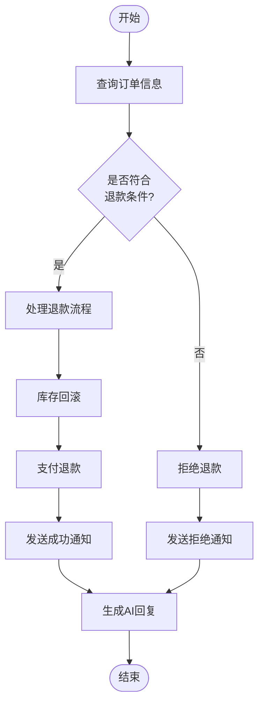

# 智能体决策引擎 - 工作流编排增强方案

## 📌 项目升级概述

基于"龙虾"智能体的复杂任务处理能力,本项目新增了**工作流编排引擎**,使系统能够处理更复杂的业务场景,不再局限于简单的知识问答。

---

## ✨ 核心增强功能

### 1. 工作流编排引擎 (Workflow Engine)

#### 1.1 功能特性
- ✅ **多节点类型支持**:工具调用、智能体调用、条件判断、并行执行、顺序执行
- ✅ **动态参数传递**:支持表达式解析 `${variable_name}`,实现节点间数据流转
- ✅ **条件分支逻辑**:根据工具返回结果动态调整执行路径(if-else)
- ✅ **并行执行优化**:同时调用多个工具/智能体,提升执行效率
- ✅ **错误处理策略**:FAIL_FAST(快速失败)、CONTINUE(继续执行)、RETRY(重试)
- ✅ **超时控制**:节点级和全局超时设置
- ✅ **执行追踪**:完整记录每个节点的执行结果和耗时

#### 1.2 技术架构
```
┌─────────────────────────────────────────────┐
│          WorkflowEngine (接口)                │
├─────────────────────────────────────────────┤
│     WorkflowEngineImpl (实现类)              │
│  ├─ executeNode()    递归执行节点            │
│  ├─ executeToolCall() 调用工具               │
│  ├─ executeAgentCall() 调用智能体            │
│  ├─ evaluateCondition() 评估条件             │
│  └─ executeParallelNodes() 并行执行          │
├─────────────────────────────────────────────┤
│          数据模型层                           │
│  ├─ WorkflowDefinition   工作流定义          │
│  ├─ WorkflowNode         节点定义            │
│  └─ WorkflowExecutionResult 执行结果         │
└─────────────────────────────────────────────┘
```

---

### 2. 订单处理工作流示例 (模拟"龙虾"智能体)

#### 2.1 业务场景
用户请求:"帮我查询订单ORDER123并申请退款"

#### 2.2 工作流执行流程


#### 2.3 关键代码位置
- 工作流定义:`OrderProcessingWorkflowService.createOrderProcessingWorkflow()`
- 执行入口:`OrderProcessingWorkflowService.processOrderRefund()`
- API接口:`WorkflowController.processOrderRefund()`

---

### 3. 并行数据查询工作流

#### 3.1 应用场景
需要同时从多个数据源获取信息并合并结果的场景,如:
- 用户画像构建(同时查询基本信息、行为数据、偏好设置)
- 商品推荐(同时查询库存、价格、评价、相似商品)

#### 3.2 执行优势
- ⚡ **性能提升**:3个查询并行执行,总耗时≈单个查询时间
- 🔄 **数据一致性**:所有查询基于同一时刻的上下文
- 📊 **结果聚合**:自动合并各分支的执行结果

---

## 🗂️ 新增文件清单

### 核心引擎
```
src/main/java/com/esdllm/agentmesh/
├── model/dto/workflow/
│   ├── WorkflowDefinition.java           # 工作流定义DTO
│   ├── WorkflowNode.java                 # 节点定义DTO
│   └── WorkflowExecutionResult.java      # 执行结果DTO
├── service/workflow/
│   ├── WorkflowEngine.java               # 工作流引擎接口
│   └── impl/
│       ├── WorkflowEngineImpl.java       # 引擎实现(427行)
│       └── OrderProcessingWorkflowService.java  # 订单处理示例(304行)
└── controller/
    └── WorkflowController.java           # 工作流API控制器
```

### 数据持久化
```
sql/
└── workflow_tables.sql                   # 数据库表结构

src/main/java/com/esdllm/agentmesh/model/domain/
├── WorkflowDefinitionEntity.java         # 工作流定义实体
└── WorkflowExecutionHistoryEntity.java   # 执行历史实体
```

---

## 🔌 API接口说明

### 1. 执行订单退款工作流
```bash
POST /api/workflow/order-refund
Params:
  - orderId: String (订单ID)
  - userId: Long (用户ID)
  - refundReason: String (退款原因,可选)

Response:
{
  "code": 0,
  "data": {
    "executionId": "wf_1_1234567890",
    "workflowId": 1,
    "success": true,
    "output": {...},
    "executionPath": ["start", "query_order", "check_refund_eligible", ...],
    "nodeResults": {
      "query_order": {
        "nodeId": "query_order",
        "nodeName": "查询订单",
        "success": true,
        "durationMs": 1234
      }
    },
    "totalDurationMs": 5678
  }
}
```

### 2. 获取工作流定义
```bash
GET /api/workflow/order-processing/definition
GET /api/workflow/parallel-query/definition
```

### 3. 执行自定义工作流
```bash
POST /api/workflow/execute
Body: WorkflowDefinition JSON
Params:
  - inputParams: Map<String, Object>
  - userId: Long
```

---

## 💡 如何扩展更多工作流场景

### 步骤1: 定义工作流节点
```java
WorkflowNode node = WorkflowNode.builder()
    .nodeId("my_step")
    .nodeName("我的步骤")
    .nodeType(WorkflowNode.NodeType.TOOL_CALL)
    .resourceId(toolId)
    .inputParams(Map.of("param1", "${variable}"))
    .build();
```

### 步骤2: 组装工作流
```java
List<WorkflowNode> nodes = Arrays.asList(startNode, step1, step2, endNode);
WorkflowDefinition workflow = WorkflowDefinition.builder()
    .workflowName("我的工作流")
    .nodes(nodes)
    .startNodeId("start")
    .build();
```

### 步骤3: 执行工作流
```java
WorkflowExecutionResult result = workflowEngine.execute(
    workflow, 
    inputParams, 
    userId
);
```

---

## 🎯 与原有系统的集成点

### 1. 复用现有服务
- `ToolsDao`:查询工具信息
- `AgentToolService`:调用工具和智能体
- `AiModelSupport`:AI模型调用

### 2. 扩展现有决策引擎
可以在`DecisionExecutorImpl`中集成工作流引擎:
```java
// 在意图识别后,判断是否需要执行工作流
if (intent.getNeedWorkflow()) {
    WorkflowDefinition workflow = loadWorkflow(intent.getWorkflowId());
    return workflowEngine.execute(workflow, params, userId);
}
```

### 3. SSE流式输出增强
在工作流执行过程中,可以通过SSE实时推送每个节点的执行状态:
```java
sseEventPublisher.sendWorkflowNodeStarted(emitter, nodeId);
// 执行节点...
sseEventPublisher.sendWorkflowNodeCompleted(emitter, nodeId, result);
```

---

## 📊 数据库设计

### workflow_definition (工作流定义表)
| 字段 | 类型 | 说明 |
|------|------|------|
| id | BIGSERIAL | 主键 |
| workflow_name | VARCHAR(200) | 工作流名称 |
| nodes_json | JSONB | 节点定义(JSON) |
| start_node_id | VARCHAR(100) | 起始节点ID |
| agent_id | BIGINT | 关联智能体ID |
| user_id | BIGINT | 创建者ID |

### workflow_execution_history (执行历史表)
| 字段 | 类型 | 说明 |
|------|------|------|
| execution_id | VARCHAR(100) | 执行ID(唯一) |
| workflow_id | BIGINT | 工作流ID |
| success | BOOLEAN | 是否成功 |
| total_duration_ms | BIGINT | 总耗时 |
| node_results_json | JSONB | 节点执行结果 |

---

## 🚀 下一步优化建议

### P0 优先级 (立即实施)
1. ✅ ~~工作流引擎核心实现~~
2. ✅ ~~订单处理示例场景~~
3. ⏳ 将工作流引擎集成到`DecisionExecutor`
4. ⏳ 前端工作流可视化编辑器

### P1 优先级 (近期规划)
1. 工作流版本管理(支持回滚)
2. 工作流模板市场(用户可分享/订阅)
3. 更强大的表达式引擎(集成SpEL)
4. 工作流调试工具(断点、单步执行)

### P2 优先级 (长期优化)
1. 分布式工作流执行(支持跨服务调用)
2. 工作流性能分析与优化建议
3. AI自动生成工作流(根据自然语言描述)
4. 工作流监控告警(异常检测)

---

## 📝 毕业论文写作要点

### 第三章 系统设计
- 3.4 工作流编排模块设计
  - 3.4.1 工作流数据模型设计
  - 3.4.2 节点执行引擎设计
  - 3.4.3 条件分支与并行执行机制

### 第四章 系统实现
- 4.3 工作流引擎核心实现
  - 4.3.1 递归节点执行算法
  - 4.3.2 参数表达式解析实现
  - 4.3.3 并行任务调度优化
- 4.4 典型应用场景实现
  - 4.4.1 订单自动化处理工作流
  - 4.4.2 并行数据查询与聚合

### 第五章 系统测试
- 5.3 工作流性能测试
  - 串行vs并行执行对比
  - 不同复杂度工作流的响应时间
  - 并发执行压力测试

---

## 🎓 创新点总结

1. **AI驱动的工作流编排**:结合意图识别自动选择合适的工作流
2. **灵活的节点类型系统**:支持工具、智能体、条件、并行等多种节点
3. **动态参数传递机制**:基于表达式的上下文数据流转
4. **细粒度错误处理**:节点级错误策略配置
5. **完整的执行追踪**:可视化展示工作流执行路径和性能指标

---

## 📚 参考文献补充

1. Camunda BPMN Engine - 工作流引擎最佳实践
2. Apache Airflow - 数据管道编排系统
3. Netflix Conductor - 微服务编排框架
4. Spring State Machine - 状态机与工作流
5. BPMN 2.0规范 - 业务流程建模标准

---

**作者**: abcLiyew  
**学号**: 202252340223  
**指导教师**: 姚迎乐  
**学校**: 郑州工程技术学院  
**专业**: 软件工程  
**日期**: 2026年4月
