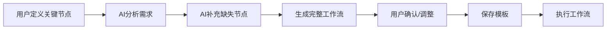

# 工作流模板系统使用指南

## 📋 功能概述

本系统支持**三种工作流模式**，满足不同用户的需求：

| 模式 | 说明 | 适用场景 | 用户参与度 |
|------|------|----------|-----------|
| **FULL_AUTO** | AI完全自主决策 | 简单任务、快速响应 | ⭐ 低 |
| **SEMI_CUSTOM** | 半自定义（AI辅助） | 复杂业务、需要控制关键点 | ⭐⭐⭐ 中 |
| **FULL_CUSTOM** | 完全自定义 | 标准化流程、高频复用 | ⭐⭐⭐⭐⭐ 高 |

## 🎯 三种模式详解

### 1️⃣ 全自动模式 (FULL_AUTO)

**特点：**
- ✅ AI完全自主决策执行路径
- ✅ 无需用户干预
- ✅ 适合简单、标准化的任务

**使用场景：**
- 日常问答
- 简单查询
- 快速原型验证

**API调用：**
```bash
# 直接执行，无需创建工作流
curl -X POST "http://localhost:8080/api/unified-agent/execute" \
  -H "Content-Type: application/json" \
  -d '{
    "agentId": 1,
    "query": "帮我查询天气",
    "context": {}
  }'
```

---

### 2️⃣ 半自定义模式 (SEMI_CUSTOM) ⭐推荐

**特点：**
- ✅ 用户定义关键节点
- ✅ AI自动补充缺失环节
- ✅ 平衡灵活性和智能化

**使用场景：**
- 订单处理（用户指定查询和退款，AI补充验证逻辑）
- 数据分析（用户指定数据源，AI补充分析步骤）
- 客户服务（用户指定响应模板，AI补充个性化内容）

#### 工作流程



#### API调用示例

**步骤1：AI辅助生成工作流**

```bash
curl -X POST "http://localhost:8080/api/unified-agent/workflow-template/ai-assist?agentId=1&taskDescription=处理订单退款" \
  -H "Content-Type: application/json" \
  -d '[
    {
      "nodeName": "查询订单信息",
      "nodeType": "TOOL_CALL",
      "resourceId": 10,
      "resourceName": "订单查询工具",
      "description": "用户自定义的关键节点"
    }
  ]'
```

**响应示例：**
```json
{
  "code": 200,
  "data": {
    "templateId": 1000,
    "templateName": "AI辅助: 处理订单退款",
    "workflowMode": "SEMI_CUSTOM",
    "userDefinedNodes": [
      {
        "nodeId": "user_node_1",
        "nodeName": "查询订单信息",
        "nodeType": "TOOL_CALL",
        "resourceId": 10,
        "isAiGenerated": false,
        "isEditable": true
      }
    ],
    "aiGeneratedNodes": [
      {
        "nodeId": "ai_node_1",
        "nodeName": "验证退款条件",
        "nodeType": "CONDITION",
        "conditionExpression": "${order.status} == '已发货'",
        "isAiGenerated": true,
        "isEditable": true,
        "description": "AI自动补充的条件判断节点"
      },
      {
        "nodeId": "ai_node_2",
        "nodeName": "调用退款工具",
        "nodeType": "TOOL_CALL",
        "resourceId": 15,
        "resourceName": "退款处理工具",
        "isAiGenerated": true,
        "isEditable": true
      },
      {
        "nodeId": "ai_node_3",
        "nodeName": "生成最终回答",
        "nodeType": "RESPONSE_GENERATION",
        "isAiGenerated": true,
        "isEditable": false
      }
    ],
    "allNodes": [...]
  }
}
```

**步骤2：用户确认后保存**

```bash
curl -X POST "http://localhost:8080/api/unified-agent/workflow-template/create" \
  -H "Content-Type: application/json" \
  -d '{
    "templateName": "订单退款标准流程",
    "description": "处理订单退款的完整流程",
    "workflowMode": "SEMI_CUSTOM",
    "userDefinedNodes": [...],
    "aiGeneratedNodes": [...],
    "agentId": 1,
    "isPublic": false
  }'
```

**步骤3：基于模板执行**

```bash
curl -X POST "http://localhost:8080/api/unified-agent/workflow-template/execute/1000" \
  -H "Content-Type: application/json" \
  -d '{
    "orderId": "ORDER123",
    "refundReason": "商品质量问题"
  }'
```

---

### 3️⃣ 完全自定义模式 (FULL_CUSTOM)

**特点：**
- ✅ 用户完整定义所有节点
- ✅ 精确控制执行流程
- ✅ 适合标准化、高频复用的业务流程

**使用场景：**
- 企业内部标准流程
- 合规性要求高的业务
- 需要审计追踪的场景

#### API调用示例

**创建完全自定义工作流：**

```bash
curl -X POST "http://localhost:8080/api/unified-agent/workflow-template/create" \
  -H "Content-Type: application/json" \
  -d '{
    "templateName": "客户投诉处理流程",
    "description": "标准的客户投诉处理SOP",
    "workflowMode": "FULL_CUSTOM",
    "userDefinedNodes": [
      {
        "nodeId": "step_1",
        "nodeName": "记录投诉信息",
        "nodeType": "TOOL_CALL",
        "resourceId": 20,
        "resourceName": "投诉记录工具",
        "inputParamsTemplate": {
          "customerId": "${customer_id}",
          "complaint": "${complaint_text}"
        },
        "timeoutMs": 5000,
        "errorStrategy": "FAIL_FAST"
      },
      {
        "nodeId": "step_2",
        "nodeName": "判断投诉等级",
        "nodeType": "CONDITION",
        "conditionExpression": "${severity} > 3",
        "nextNodeId": "step_3"
      },
      {
        "nodeId": "step_3",
        "nodeName": "升级处理",
        "nodeType": "AGENT_CALL",
        "resourceId": 5,
        "resourceName": "高级客服智能体"
      },
      {
        "nodeId": "step_4",
        "nodeName": "发送处理结果",
        "nodeType": "TOOL_CALL",
        "resourceId": 25,
        "resourceName": "邮件通知工具"
      }
    ],
    "startNodeId": "step_1",
    "agentId": 1,
    "isPublic": false
  }'
```

---

## 💻 前端集成示例

### Vue3 + TypeScript

```typescript
// types/workflow.ts
export type WorkflowMode = 'FULL_AUTO' | 'SEMI_CUSTOM' | 'FULL_CUSTOM';

export interface TemplateNode {
  nodeId?: string;
  nodeName: string;
  nodeType: string;
  resourceId?: number;
  resourceName?: string;
  inputParamsTemplate?: Record<string, any>;
  conditionExpression?: string;
  isAiGenerated?: boolean;
  isEditable?: boolean;
  description?: string;
}

export interface WorkflowTemplate {
  templateId?: number;
  templateName: string;
  description: string;
  workflowMode: WorkflowMode;
  userDefinedNodes?: TemplateNode[];
  aiGeneratedNodes?: TemplateNode[];
  allNodes?: TemplateNode[];
  agentId: number;
  isPublic?: boolean;
}

// composables/useWorkflowTemplate.ts
import { ref } from 'vue';
import axios from 'axios';

export function useWorkflowTemplate() {
  const templates = ref<WorkflowTemplate[]>([]);
  const currentTemplate = ref<WorkflowTemplate | null>(null);

  // AI辅助生成工作流
  const aiAssistWorkflow = async (
    agentId: number,
    taskDescription: string,
    userNodes: TemplateNode[] = []
  ) => {
    const response = await axios.post(
      '/api/unified-agent/workflow-template/ai-assist',
      userNodes,
      {
        params: { agentId, taskDescription }
      }
    );
    return response.data.data as WorkflowTemplate;
  };

  // 创建工作流模板
  const createTemplate = async (template: WorkflowTemplate) => {
    const response = await axios.post(
      '/api/unified-agent/workflow-template/create',
      template
    );
    return response.data.data.templateId as number;
  };

  // 获取模板列表
  const fetchTemplates = async (mode?: WorkflowMode) => {
    const response = await axios.get(
      '/api/unified-agent/workflow-template/list',
      { params: { mode } }
    );
    templates.value = response.data.data;
  };

  // 基于模板执行
  const executeFromTemplate = async (
    templateId: number,
    inputParams?: Record<string, any>
  ) => {
    const response = await axios.post(
      `/api/unified-agent/workflow-template/execute/${templateId}`,
      inputParams || {}
    );
    return response.data.data;
  };

  return {
    templates,
    currentTemplate,
    aiAssistWorkflow,
    createTemplate,
    fetchTemplates,
    executeFromTemplate
  };
}
```

### 组件示例：AI辅助工作流编辑器

```vue
<template>
  <div class="workflow-editor">
    <h2>🤖 AI辅助工作流编辑器</h2>
    
    <!-- 任务描述 -->
    <div class="task-input">
      <label>任务描述：</label>
      <textarea 
        v-model="taskDescription" 
        placeholder="例如：处理订单退款，需要先查询订单，然后验证条件，最后执行退款"
      />
    </div>

    <!-- 用户定义的节点 -->
    <div class="user-nodes">
      <h3>您定义的关键节点：</h3>
      <div v-for="(node, index) in userNodes" :key="index" class="node-card">
        <input v-model="node.nodeName" placeholder="节点名称" />
        <select v-model="node.nodeType">
          <option value="TOOL_CALL">工具调用</option>
          <option value="AGENT_CALL">智能体调用</option>
          <option value="CONDITION">条件判断</option>
        </select>
        <button @click="removeNode(index)">删除</button>
      </div>
      <button @click="addNode">+ 添加节点</button>
    </div>

    <!-- AI生成按钮 -->
    <button 
      @click="handleAiAssist" 
      :disabled="isGenerating || !taskDescription"
    >
      {{ isGenerating ? 'AI生成中...' : '🤖 AI辅助生成' }}
    </button>

    <!-- AI生成的节点预览 -->
    <div v-if="generatedTemplate" class="ai-nodes">
      <h3>🤖 AI补充的节点：</h3>
      <div 
        v-for="node in generatedTemplate.aiGeneratedNodes" 
        :key="node.nodeId"
        class="node-card ai-node"
      >
        <span class="ai-badge">AI生成</span>
        <strong>{{ node.nodeName }}</strong>
        <p>{{ node.description }}</p>
        <span v-if="!node.isEditable" class="locked">🔒 不可编辑</span>
      </div>
    </div>

    <!-- 操作按钮 -->
    <div v-if="generatedTemplate" class="actions">
      <button @click="handleSave">💾 保存模板</button>
      <button @click="handleExecute">▶️ 立即执行</button>
    </div>
  </div>
</template>

<script setup lang="ts">
import { ref } from 'vue';
import { useWorkflowTemplate } from '@/composables/useWorkflowTemplate';

const { aiAssistWorkflow, createTemplate, executeFromTemplate } = useWorkflowTemplate();

const taskDescription = ref('');
const userNodes = ref<any[]>([]);
const generatedTemplate = ref<any>(null);
const isGenerating = ref(false);

const addNode = () => {
  userNodes.value.push({
    nodeName: '',
    nodeType: 'TOOL_CALL',
    isAiGenerated: false,
    isEditable: true
  });
};

const removeNode = (index: number) => {
  userNodes.value.splice(index, 1);
};

const handleAiAssist = async () => {
  isGenerating.value = true;
  try {
    generatedTemplate.value = await aiAssistWorkflow(
      1, // agentId
      taskDescription.value,
      userNodes.value
    );
  } finally {
    isGenerating.value = false;
  }
};

const handleSave = async () => {
  if (!generatedTemplate.value) return;
  
  const templateId = await createTemplate(generatedTemplate.value);
  alert(`模板保存成功！ID: ${templateId}`);
};

const handleExecute = async () => {
  if (!generatedTemplate.value?.templateId) return;
  
  const result = await executeFromTemplate(
    generatedTemplate.value.templateId,
    {} // inputParams
  );
  
  console.log('执行结果:', result);
};
</script>

<style scoped>
.workflow-editor {
  max-width: 800px;
  margin: 0 auto;
  padding: 20px;
}

.task-input textarea {
  width: 100%;
  min-height: 80px;
  padding: 10px;
  border: 1px solid #ddd;
  border-radius: 4px;
}

.node-card {
  padding: 15px;
  margin: 10px 0;
  background: #f9f9f9;
  border-radius: 8px;
  border-left: 4px solid #4CAF50;
}

.ai-node {
  border-left-color: #2196F3;
  background: #e3f2fd;
}

.ai-badge {
  background: #2196F3;
  color: white;
  padding: 2px 8px;
  border-radius: 4px;
  font-size: 0.8em;
  margin-right: 10px;
}

.locked {
  color: #999;
  font-size: 0.9em;
}

.actions {
  margin-top: 20px;
  display: flex;
  gap: 10px;
}
</style>
```

---

## 📊 三种模式对比

| 特性 | FULL_AUTO | SEMI_CUSTOM | FULL_CUSTOM |
|------|-----------|-------------|-------------|
| **灵活性** | 低 | 中 | 高 |
| **智能化** | 高 | 高 | 低 |
| **控制力** | 低 | 中 | 高 |
| **开发成本** | 无 | 低 | 高 |
| **适用人群** | 普通用户 | 进阶用户 | 专业用户 |
| **复用性** | 低 | 中 | 高 |
| **可维护性** | 低 | 中 | 高 |

---

## 🎨 UI设计建议

### 工作流模板选择器

```
┌─────────────────────────────────────┐
│ 选择工作流模式                       │
├─────────────────────────────────────┤
│                                     │
│  ○ 全自动模式 (AI完全自主)           │
│     适合：简单任务、快速响应          │
│                                     │
│  ● 半自定义模式 (AI辅助)  ⭐推荐     │
│     适合：复杂业务、需要控制关键点     │
│     [您定义关键节点，AI补充细节]      │
│                                     │
│  ○ 完全自定义模式                    │
│     适合：标准化流程、高频复用        │
│                                     │
└─────────────────────────────────────┘
```

### 半自定义编辑器

```
┌─────────────────────────────────────┐
│ 🤖 AI辅助工作流编辑器                │
├─────────────────────────────────────┤
│ 任务描述：                           │
│ [处理订单退款，需要查询订单并验证条件] │
│                                     │
│ ─── 您定义的节点 ───                │
│ ☑ 1. 查询订单信息 [工具调用]         │
│                                     │
│ [➕ 添加节点]                        │
│                                     │
│ [🤖 AI辅助生成]                     │
│                                     │
│ ─── AI补充的节点 ───                │
│ ☑ 2. 验证退款条件 [条件判断] 🔓      │
│ ☑ 3. 调用退款工具 [工具调用] 🔓      │
│ ☑ 4. 生成最终回答 [回答生成] 🔒      │
│                                     │
│ [💾 保存模板] [▶️ 立即执行]          │
└─────────────────────────────────────┘
```

---

## 🔧 高级配置

### 节点类型说明

| 节点类型 | 说明 | 必填字段 |
|---------|------|---------|
| TOOL_CALL | 调用工具 | resourceId, resourceName |
| AGENT_CALL | 调用智能体 | resourceId, resourceName |
| CONDITION | 条件判断 | conditionExpression |
| SEQUENCE | 顺序执行 | childNodeIds |
| PARALLEL | 并行执行 | childNodeIds |
| RESPONSE_GENERATION | 生成回答 | 无 |
| KNOWLEDGE_RETRIEVAL | 知识库检索 | 无 |

### 错误处理策略

- **FAIL_FAST**: 遇到错误立即终止
- **CONTINUE**: 跳过错误节点继续执行
- **RETRY**: 重试失败的节点（最多3次）

---

## 📈 最佳实践

### 1. 何时使用半自定义模式？

✅ **推荐使用：**
- 业务流程有明确的关键步骤
- 部分环节需要人工审核
- 希望AI补充细节但不想完全失控

❌ **不推荐：**
- 极其简单的任务（用全自动）
- 严格合规的流程（用完全自定义）

### 2. 如何设计可复用的模板？

```javascript
// 好的模板设计
{
  "templateName": "通用订单处理流程",
  "description": "适用于所有订单相关操作",
  "userDefinedNodes": [
    {
      "nodeName": "查询订单",
      "inputParamsTemplate": {  // 使用参数模板
        "orderId": "${order_id}"  // 运行时替换
      }
    }
  ]
}

// 执行时传入实际参数
{
  "order_id": "ORDER123"
}
```

### 3. 模板版本管理

建议在数据库中添加版本字段：
```sql
ALTER TABLE workflow_template ADD COLUMN version VARCHAR(20) DEFAULT '1.0';
ALTER TABLE workflow_template ADD COLUMN parent_template_id BIGINT;
```

---

## 🚀 快速开始

### 测试半自定义工作流

```bash
# 1. AI辅助生成
curl -X POST "http://localhost:8080/api/unified-agent/workflow-template/ai-assist?agentId=1&taskDescription=查询订单状态" \
  -H "Content-Type: application/json" \
  -d '[{"nodeName": "查询订单", "nodeType": "TOOL_CALL", "resourceId": 10}]'

# 2. 保存模板（使用返回的templateId）
curl -X POST "http://localhost:8080/api/unified-agent/workflow-template/create" \
  -H "Content-Type: application/json" \
  -d '{...}'

# 3. 执行模板
curl -X POST "http://localhost:8080/api/unified-agent/workflow-template/execute/1000" \
  -H "Content-Type: application/json" \
  -d '{"orderId": "ORDER123"}'
```

---

**最后更新**: 2026-04-19  
**版本**: v2.2.0
