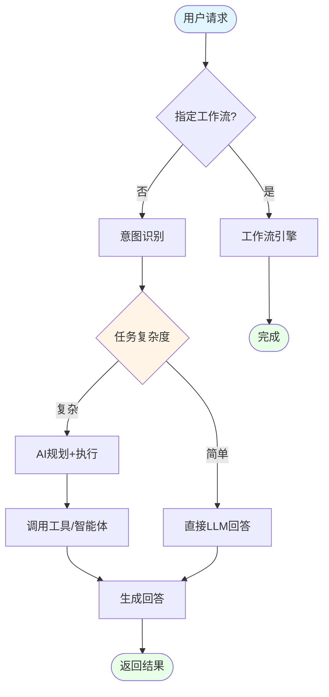
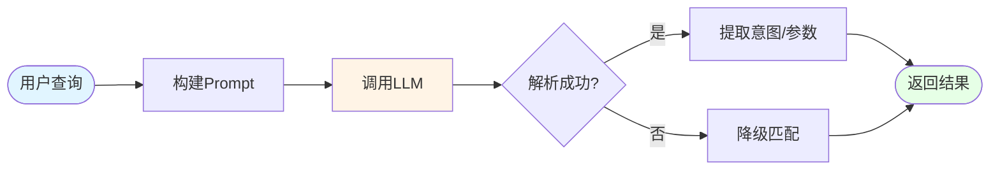
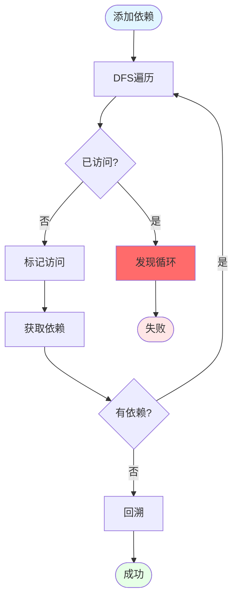
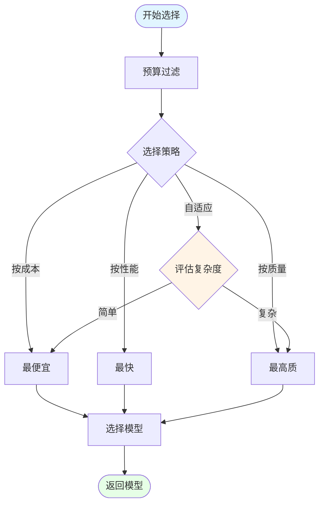
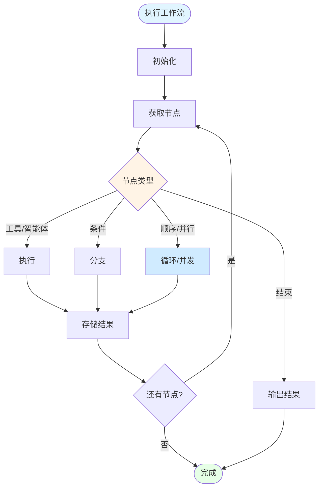
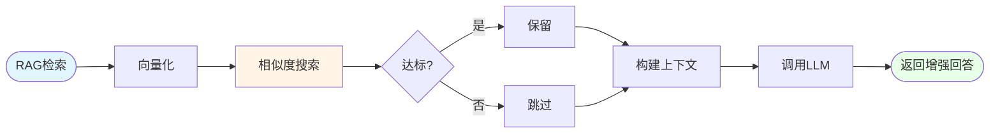
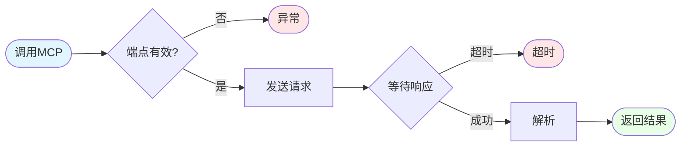
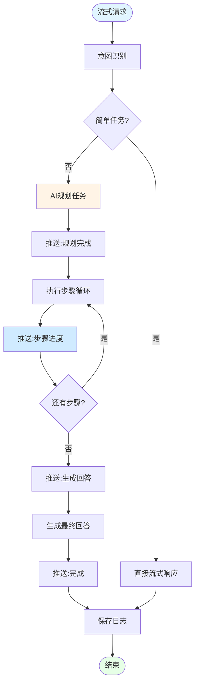

# 智能体决策引擎执行流程图（核心版）

## 1. 统一引擎主执行流程

## 2. 意图识别流程

## 3. 循环依赖检测（DFS）

## 4. 自适应模型选择

## 5. 工作流递归执行

## 6. RAG检索增强

## 7. MCP工具调用

## 8. 流式执行（SSE）

---

## 图例说明

| 颜色 | 含义 |
|------|------|
| 🔵 浅蓝 | 开始/结束节点 |
| 🟡 浅黄 | 关键决策点/算法核心 |
| 🟢 浅绿 | 成功/完成状态 |
| 🔴 浅红 | 错误/异常处理 |
| 🔷 浅蓝灰 | 并行/异步操作 |

---

**生成时间**: 2026-04-28  
**适用场景**: 毕业论文答辩、技术文档、系统设计评审

https://agent.qianwen.com/mos/485a77f2352a43799b394bf8d0ec645c/cc893c1b1ed5a42123b6a2438b98db1f
