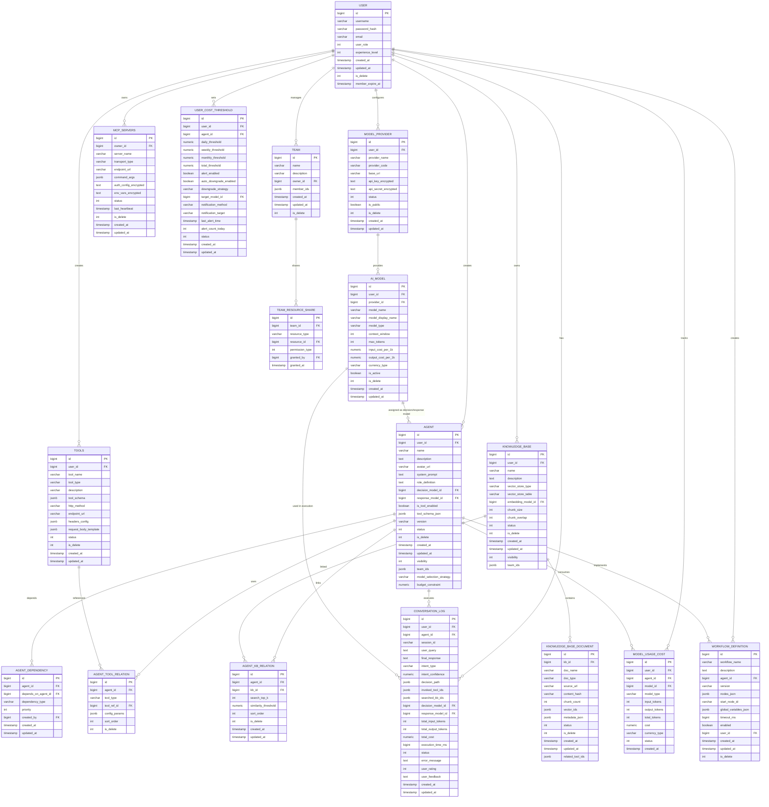
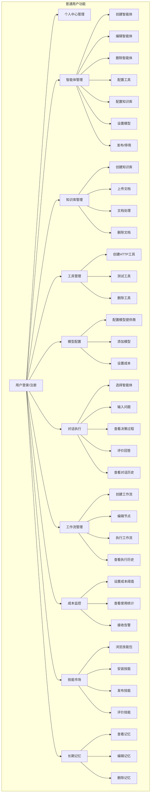
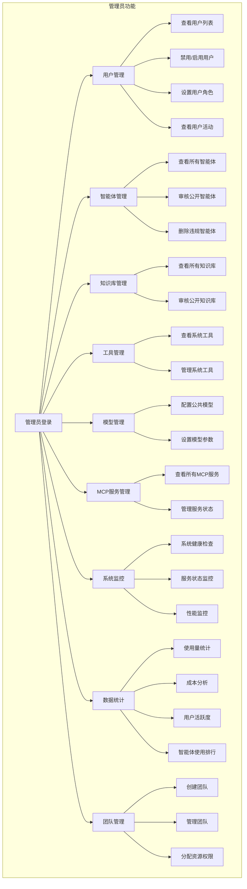
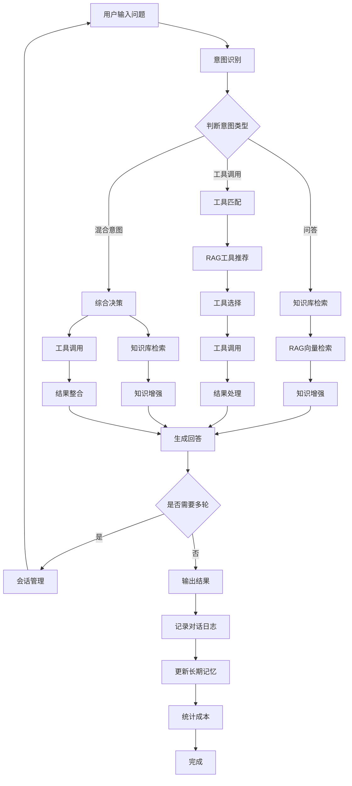

# Agent Mesh 系统图表

## 一、实体关系图 (ER Diagram)

### 1. 核心实体关系图

## 二、用例图 (Use Case Diagram)

### 1. 普通用户用例图

### 2. 管理员用例图

## 三、系统功能模块图

```mermaid
graph TB
    System[基于SpringBoot+SpringAI的智能体决策引擎系统]
    
    System --> UserModule[用户模块]
    System --> AgentModule[智能体模块]
    System --> KnowledgeModule[知识库模块]
    System --> ToolModule[工具模块]
    System --> ModelModule[模型模块]
    System --> WorkflowModule[工作流模块]
    System --> McpModule[MCP服务模块]
    System --> CostModule[成本监控模块]
    System --> SkillModule[技能市场模块]
    System --> TeamModule[团队协作模块]
    System --> MemoryModule[长期记忆模块]
    System --> AdminModule[系统管理模块]
    
    UserModule --> UM1[用户注册登录]
    UserModule --> UM2[个人中心]
    UserModule --> UM3[角色权限管理]
    UserModule --> UM4[会员管理]
    
    AgentModule --> AG1[智能体创建]
    AgentModule --> AG2[智能体配置]
    AgentModule --> AG3[智能体发布]
    AgentModule --> AG4[智能体执行]
    AgentModule --> AG5[意图识别]
    AgentModule --> AG6[自主决策]
    AgentModule --> AG7[智能体依赖]
    
    KnowledgeModule --> KB1[知识库创建]
    KnowledgeModule --> KB2[文档上传]
    KnowledgeModule --> KB3[文档处理]
    KnowledgeModule --> KB4[向量存储]
    KnowledgeModule --> KB5[RAG检索]
    KnowledgeModule --> KB6[文档管理]
    
    ToolModule --> TL1[系统工具]
    ToolModule --> TL2[HTTP工具]
    ToolModule --> TL3[MCP工具]
    ToolModule --> TL4[工具测试]
    ToolModule --> TL5[工具推荐]
    ToolModule --> TL6[工具调用]
    
    ModelModule --> MD1[模型提供商配置]
    ModelModule --> MD2[模型管理]
    ModelModule --> MD3[模型选择策略]
    ModelModule --> MD4[多模型协同]
    ModelModule --> MD5[模型调用]
    
    WorkflowModule --> WF1[工作流定义]
    WorkflowModule --> WF2[节点配置]
    WorkflowModule --> WF3[工作流执行]
    WorkflowModule --> WF4[执行历史]
    WorkflowModule --> WF5[条件分支]
    WorkflowModule --> WF6[并行执行]
    
    McpModule --> MC1[MCP服务配置]
    McpModule --> MC2[服务连接管理]
    McpModule --> MC3[服务状态监控]
    McpModule --> MC4[工具发现]
    
    CostModule --> CT1[成本统计]
    CostModule --> CT2[阈值配置]
    CostModule --> CT3[告警通知]
    CostModule --> CT4[自动降级]
    CostModule --> CT5[使用量分析]
    
    SkillModule --> SK1[技能包浏览]
    SkillModule --> SK2[技能安装]
    SkillModule --> SK3[技能发布]
    SkillModule --> SK4[技能评价]
    SkillModule --> SK5[技能管理]
    
    TeamModule --> TM1[团队创建]
    TeamModule --> TM2[成员管理]
    TeamModule --> TM3[资源共享]
    TeamModule --> TM4[权限控制]
    
    MemoryModule --> MM1[记忆存储]
    MemoryModule --> MM2[记忆检索]
    MemoryModule --> MM3[记忆更新]
    MemoryModule --> MM4[记忆管理]
    
    AdminModule --> AD1[用户管理]
    AdminModule --> AD2[资源审核]
    AdminModule --> AD3[系统监控]
    AdminModule --> AD4[数据统计]
    AdminModule --> AD5[配置管理]
```

## 四、智能体执行流程图

## 五、实体详细说明

### 1. 用户实体 (User)
- **主要属性**: id, username, passwordHash, email, userRole, experienceLevel, createdAt, updatedAt
- **角色**: 0=普通用户, 90=管理员, 99=超级管理员
- **关系**: 拥有智能体、知识库、工具、模型配置等

### 2. 智能体实体 (Agent)
- **主要属性**: id, userId, name, description, systemPrompt, decisionModelId, responseModelId, toolSchemaJson, version, status
- **特性**: 支持双模型架构(决策模型+回复模型)、工具配置、版本管理
- **关系**: 关联工具、知识库、模型、依赖关系

### 3. 模型提供商 (ModelProvider)
- **主要属性**: id, userId, providerName, providerCode, baseUrl, apiKeyEncrypted, status
- **关系**: 提供多个AI模型

### 4. AI模型 (AiModel)
- **主要属性**: id, userId, providerId, modelName, modelType, contextWindow, maxTokens, inputCostPer1k, outputCostPer1k
- **类型**: CHAT, EMBEDDING, IMAGE
- **关系**: 归属提供商、被智能体使用

### 5. 知识库 (KnowledgeBase)
- **主要属性**: id, userId, name, description, vectorStoreType, embeddingModelId, chunkSize, chunkOverlap
- **关系**: 包含多个文档、被智能体关联

### 6. 工具 (Tools)
- **主要属性**: id, userId, toolName, toolType, toolSchema, endpointUrl
- **类型**: SYSTEM, USER_HTTP, USER_MCP
- **关系**: 被智能体关联使用

### 7. MCP服务器 (McpServers)
- **主要属性**: id, ownerId, serverName, transportType, endpointUrl, commandArgs
- **传输协议**: SSE, STDIO, STREAMABLE_HTTP

### 8. 对话日志 (ConversationLog)
- **主要属性**: id, userId, agentId, sessionId, userQuery, finalResponse, intentType, decisionPath, totalCost
- **用途**: 记录对话过程、决策路径、成本统计

### 9. 工作流定义 (WorkflowDefinition)
- **主要属性**: id, workflowName, agentId, version, nodesJson, startNodeId, globalVariablesJson
- **特性**: 支持多节点编排、条件分支、并行执行

### 10. 团队 (Team)
- **主要属性**: id, name, description, ownerId, memberIds
- **关系**: 共享资源、权限管理

## 六、数据关系总结

### 核心关联关系
1. **User → Agent**: 一对多，用户创建和管理智能体
2. **Agent → Tools**: 多对多，通过AgentToolRelation关联
3. **Agent → KnowledgeBase**: 多对多，通过AgentKbRelation关联
4. **ModelProvider → AiModel**: 一对多，提供商提供多个模型
5. **Agent → AiModel**: 多对一，智能体配置决策模型和回复模型
6. **KnowledgeBase → KnowledgeBaseDocument**: 一对多，知识库包含多个文档
7. **User → Team**: 一对多，用户创建和管理团队
8. **Team → Resources**: 一对多，团队共享资源

### 数据隔离策略
- **用户级隔离**: 大部分资源通过userId关联，实现多租户数据隔离
- **团队共享**: 通过visibility和teamIds字段控制资源可见性
- **公开资源**: 支持资源公开共享(visibility=2)

### 关键设计特点
1. **逻辑删除**: 所有主要实体支持isDelete字段
2. **版本管理**: Agent和Workflow支持版本控制
3. **成本监控**: 完整的成本统计和阈值告警机制
4. **权限控制**: 用户角色、团队权限、资源可见性三级权限体系
5. **多模型协同**: 支持多个模型提供商和模型选择策略
