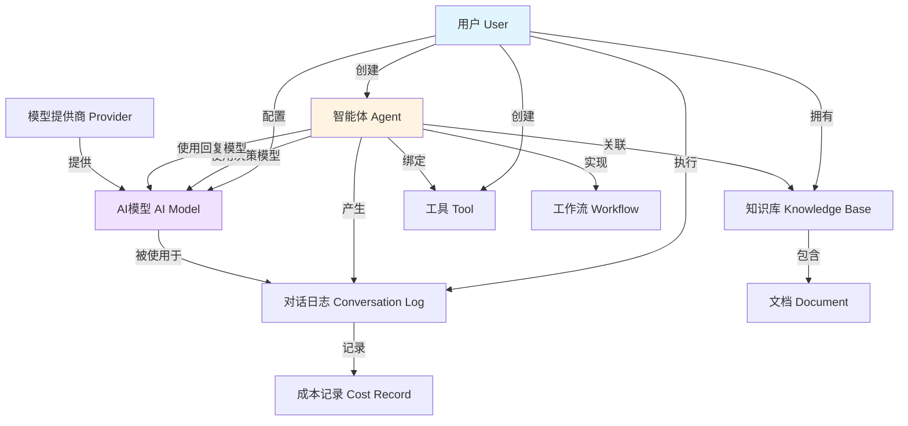
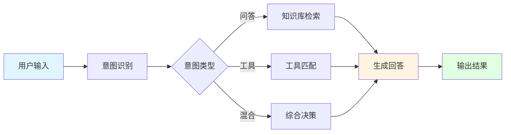

# Agent Mesh 系统图表（论文简化版）

## 图 1：系统功能模块图

参考农产品销售管理系统风格，展示用户和管理员两大角色的功能模块：

```
基于SpringBoot+SpringAI的智能体决策引擎系统
├── 用户端
│   ├── 个人中心
│   │   ├── 个人信息管理
│   │   ├── 会员管理
│   │   └── 权限设置
│   ├── 智能体管理
│   │   ├── 创建智能体
│   │   ├── 配置模型
│   │   ├── 绑定工具
│   │   ├── 关联知识库
│   │   └── 发布管理
│   ├── 对话执行
│   │   ├── 智能体选择
│   │   ├── 问题输入
│   │   ├── 决策过程查看
│   │   └── 结果评价
│   ├── 知识库管理
│   │   ├── 创建知识库
│   │   ├── 文档上传
│   │   └── 文档管理
│   ├── 工具管理
│   │   ├── HTTP工具创建
│   │   ├── 工具测试
│   │   └── 工具配置
│   ├── 工作流管理
│   │   ├── 工作流设计
│   │   ├── 节点配置
│   │   └── 执行监控
│   ├── 成本监控
│   │   ├── 使用统计
│   │   ├── 阈值设置
│   │   └── 告警管理
│   └── 技能市场
│       ├── 技能浏览
│       ├── 技能安装
│       └── 技能发布
│
└── 管理员端
    ├── 用户管理
    │   ├── 用户列表
    │   ├── 角色分配
    │   └── 状态管理
    ├── 资源审核
    │   ├── 智能体审核
    │   ├── 知识库审核
    │   └── 技能审核
    ├── 模型管理
    │   ├── 公共模型配置
    │   └── 模型参数设置
    ├── 系统监控
    │   ├── 健康检查
    │   ├── 服务监控
    │   └── 性能分析
    ── 数据统计
        ├── 使用量统计
        ├── 成本分析
        └── 活跃度分析
```

## 图 2：核心实体关系图（简化版）



**说明**：
- **用户(User)**：系统的使用者，分为普通用户和管理员
- **智能体(Agent)**：核心实体，配置系统提示词、模型、工具和知识库
- **AI模型(Model)**：由模型提供商提供，分为决策模型和回复模型
- **知识库(KB)**：存储文档并提供RAG检索能力
- **工具(Tool)**：智能体可调用的外部功能
- **工作流(Workflow)**：多步骤任务编排
- **对话日志(Conversation)**：记录执行过程和成本

## 图 3：用户实体属性图

```
用户 (User)
── 基本信息
│   ├── id (主键)
│   ├── username (用户名)
│   ├── passwordHash (密码)
│   └── email (邮箱)
── 角色信息
│   ├── userRole (角色: 0=用户, 90=管理员, 99=超级管理员)
│   └── experienceLevel (经验值)
├── 时间信息
│   ├── createdAt (创建时间)
│   └── updatedAt (更新时间)
└── 其他
    ├── isDelete (逻辑删除标记)
    └── memberExpireAt (会员过期时间)
```

## 图 4：智能体实体属性图

```
智能体 (Agent)
├── 基本信息
│   ├── id (主键)
│   ├── userId (归属用户)
│   ├── name (智能体名称)
│   ├── description (简介)
│   └── avatarUrl (头像)
├── 核心配置
│   ├── systemPrompt (系统提示词)
│   ├── roleDefinition (角色定义)
│   ├── decisionModelId (决策模型ID)
│   └── responseModelId (回复模型ID)
├── 工具配置
│   ├── isToolEnabled (是否启用工具)
│   ── toolSchemaJson (工具配置)
├── 高级特性
│   ├── modelSelectionStrategy (模型选择策略)
│   ├── budgetConstraint (预算约束)
│   ├── version (版本号)
│   └── visibility (可见性: 0=私有, 1=团队, 2=公开)
└── 状态信息
    ├── status (状态: 1=发布, 0=草稿)
    ├── createdAt (创建时间)
    └── updatedAt (更新时间)
```

## 图 5：智能体决策执行流程



## 图 6：系统架构层次图

```
┌─────────────────────────────────────────────────┐
│              前端展示层 (Vue)                    │
│  智能体管理 | 对话界面 | 工作流设计 | 数据统计   │
└─────────────────────────────────────────────────┘
                    ↓
┌─────────────────────────────────────────────────┐
│           业务逻辑层 (SpringBoot)                │
│  ┌──────────┬──────────┬──────────┬──────────┐  │
│  │智能体引擎│ RAG服务  │工具服务  │工作流引擎│  │
│  └──────────┴──────────┴──────────┴──────────┘  │
│  ┌──────────┬──────────┬──────────┬──────────┐  │
│  │模型管理  │成本监控  │技能市场  │团队协作  │  │
│  └──────────┴──────────┴──────────┴──────────┘  │
└─────────────────────────────────────────────────┘
                    ↓
┌─────────────────────────────────────────────────┐
│           AI能力层 (SpringAI)                    │
│  OpenAI | Ollama | DashScope | 多模型路由       │
─────────────────────────────────────────────────┘
                    ↓
┌─────────────────────────────────────────────────
│           数据存储层 (PostgreSQL)                │
│  业务数据 | 向量存储 | 对话日志 | 成本记录       │
└─────────────────────────────────────────────────┘
```

## 图 7：关键实体关联关系

```
用户 (User) 1 ──┐
                ├── n 智能体 (Agent)
智能体 (Agent) n ──┘
    │
    ├── n:n 工具 (Tools) [通过关联表]
    ├── n:n 知识库 (KnowledgeBase) [通过关联表]
    ├── n:1 决策模型 (AiModel)
    ├── n:1 回复模型 (AiModel)
    ── 1:n 对话日志 (ConversationLog)

模型提供商 (Provider) 1 ─ n AI模型 (AiModel)

知识库 (KnowledgeBase) 1 ── n 文档 (Document)

智能体 (Agent) n ── n 智能体依赖 (AgentDependency)
```

## 使用建议

1. **论文插图选择**：
   - 系统功能模块图（图1）：适合放在"系统功能设计"章节
   - 核心实体关系图（图2）：适合放在"数据库设计"章节
   - 决策执行流程（图5）：适合放在"核心算法"或"工作流程"章节
   - 系统架构图（图6）：适合放在"系统架构"章节

2. **绘制工具**：
   - 使用 Visio、Draw.io 或 ProcessOn 重新绘制
   - 保持统一的配色方案和线条样式
   - 字体大小建议：标题14pt，内容12pt

3. **简化原则**：
   - 只显示核心实体和主要关系
   - 省略关联表和次要属性
   - 使用文字说明补充细节
